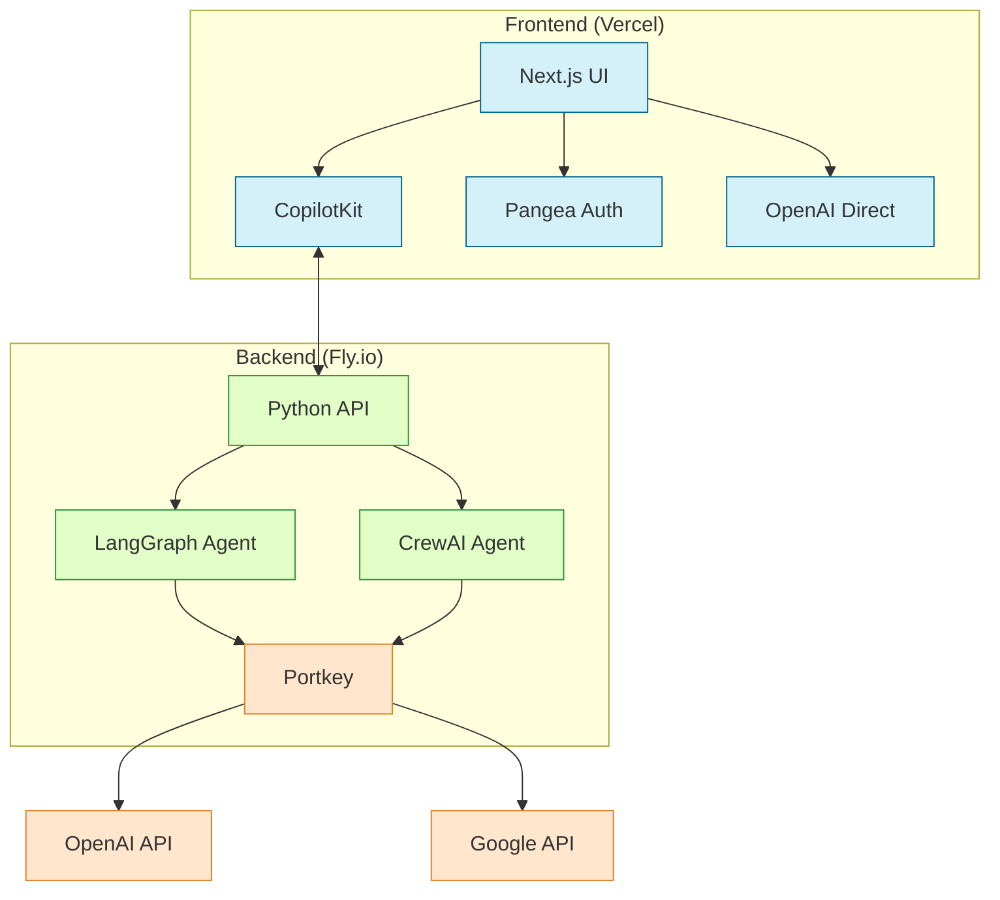

# Scott's Perplexity Clone: Technical Architecture

This document explains the technical architecture and operational mechanics of Scott's Perplexity Clone, an AI research assistant inspired by Perplexity AI. The system features a sophisticated multi-agent architecture, secure authentication, and a responsive frontend.

## System Architecture

The application operates as a distributed system with several interconnected components:



1. **Frontend (Vercel)**: A Next.js application that provides the user interface and client-side functionality
   - **Next.js UI**: The core user interface components and pages
   - **CopilotKit**: Manages communication with the backend and provides the chat interface
   - **Pangea Auth**: Handles user authentication through Pangea's hosted login
   - **OpenAI Direct**: Direct integration with OpenAI for chat suggestions and UI enhancements

2. **Backend (Fly.io)**: Python-based API and AI agents that perform complex reasoning tasks
   - **Python API**: FastAPI endpoints that receive requests from the frontend
   - **LangGraph Agent**: The default agent architecture using directed graph-based reasoning
   - **CrewAI Agent**: Alternative multi-agent system with specialized agent roles
   - **Portkey**: API gateway that manages connections to various LLM providers

3. **External Services**:
   - **OpenAI API**: Provides access to GPT models for both direct frontend use and backend agents
   - **Google API**: Provides access to Gemini models for backend agents

## How Model Selection Works

The model selection system is a core feature that allows users to switch between different AI backends:

### Selection Flow

When a user selects a model from the dropdown menu in the UI:

1. The `model-selector-provider.tsx` component captures this selection
2. It updates the URL with a `coAgentsModel` query parameter (e.g., `?coAgentsModel=crewai`)  
3. A full page reload is triggered via `window.location.href = url.toString()`
4. On page reload, the application reads the URL parameter to determine which model to use

### Agent Mapping Logic

The selected model determines which agent architecture handles the user's queries:

```typescript
// From model-selector-provider.tsx
let agent = "research_agent"; // Default LangGraph agent
if (model === "model3") {
  agent = "research_agent_google_genai"; // Google Gemini model via LangGraph
} else if (model === "crewai") {
  agent = "research_agent_crewai"; // CrewAI agent
}
```

This agent identifier is passed to CopilotKit, which routes requests to the appropriate backend endpoint.

## Agent Architecture Comparison

### LangGraph Implementation

The LangGraph agent operates as a directed graph of reasoning steps:

1. **Query Analysis**: The agent first analyzes the user's research question
2. **Search Planning**: It formulates search queries based on the analysis
3. **Web Search**: Executes searches and retrieves relevant content
4. **Content Processing**: Extracts and processes information from search results
5. **Answer Synthesis**: Generates a comprehensive answer based on retrieved information

State is maintained throughout this process in a graph structure, allowing for complex reasoning flows and backtracking when needed.

### CrewAI Implementation

The CrewAI agent takes a different approach using a team of specialized agents:

1. **Research Manager**: Coordinates the overall research process
2. **Search Specialist**: Focuses on finding relevant information
3. **Content Analyst**: Analyzes and extracts key information from sources
4. **Report Writer**: Synthesizes findings into a coherent response

These agents communicate and collaborate to solve the research query, providing a different perspective through their specialized roles.

## Backend API Management

### Portkey Integration

Rather than hardcoding API keys and model configurations, the backend integrates with Portkey to manage:

- **API Authentication**: Securely stores and rotates API keys for various LLM providers
- **Traffic Routing**: Intelligently routes requests to different models based on availability and cost
- **Usage Tracking**: Monitors API usage and costs across different providers
- **Rate Limiting**: Prevents exceeding API rate limits

This architecture allows the system to seamlessly switch between different LLM providers without code changes, enhancing reliability and flexibility.

## Frontend Authentication System

### Pangea Integration

The application uses Pangea's hosted authentication service for secure user management:

1. **Authentication Flow**: 
   - Users are redirected to Pangea's hosted login page
   - After successful authentication, they're redirected back with a session token
   - The `AuthGuard` component verifies this token before allowing access to protected content

2. **Session Management**:
   - The Pangea SDK manages session state on the client side
   - The `useRequireAuth` hook checks authentication status on protected routes
   - When a user clicks the logout link (displayed as "Logout: user@email.com"), the session is terminated

This approach offloads authentication complexity to a specialized service while maintaining a seamless user experience.

## Frontend-Backend Communication

### CopilotKit as the Bridge

CopilotKit serves as the communication layer between the frontend and backend:

1. **State Synchronization**: 
   - The frontend initializes CopilotKit with the selected agent and model
   - CopilotKit maintains the chat state and history

2. **API Communication**:
   - When a user submits a query, CopilotKit sends it to the appropriate backend endpoint
   - The backend processes the query through the selected agent architecture
   - Responses are streamed back to the frontend in real-time

```typescript
// From Main.tsx
const { copilotContext } = useCopilotContext({
  name: agent,
  initialState: {
    model,
    research_question: "",
    resources: [],
    report: "",
    logs: [],
  },
});
```

### Direct OpenAI Integration

In addition to the backend agents, the UI directly integrates with OpenAI for specific features:

```typescript
// From Main.tsx
useCopilotChatSuggestions({
  instructions: [
    "What is quantum computing?",
    "Explain climate change impacts",
    "History of artificial intelligence"
  ].join('\n'),
});
```

This allows for immediate suggestions and UI enhancements without routing through the more complex backend agents.

## Production Infrastructure

The application runs on a distributed cloud infrastructure:

- **Frontend**: Deployed on Vercel's global edge network for low-latency access
- **Backend**: Hosted on Fly.io, providing containerized Python execution near users

This separation of concerns allows each component to scale independently and use the most appropriate technology for its requirements.

## Security Architecture

Security is implemented through multiple layers:

- **Authentication**: Pangea's hosted login provides secure user authentication
- **API Security**: Portkey manages API keys, preventing exposure in code or environment variables
- **Session Management**: Client-side session validation ensures only authenticated users can access protected resources
- **Secure Communication**: All communication between components occurs over HTTPS
